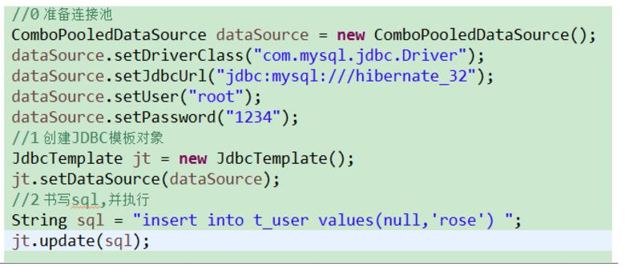
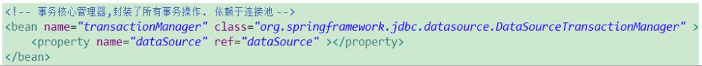

# day01

### spring介绍

三层架构中的位置：

spring是一站式的框架，因为它是属于容器性质的，装什么对象就有什么功能

核心是控制反转（IOC）和面向切面（AOP）

### 入门用法
- 创建一个对象，如：
	
- 配置文件，位置任意(建议放到src下)，配置文件名任意(建议applicationContext.xml)
- 把对象交给spring容器管理
	
- 使用对象
	

### IOC和DI
- IOC :控制反转,将对象的创建权交给了Spring
- DI :Dependency Injection。 依赖注入，需要有 IOC 的环境,Spring 创建这个类的过程中,Spring 将类的依赖的属性设置进去

### spring的容器

- BeanFactory接口
	- spring原始接口。针对原始接口的实现类功能较为单一
	- BeanFactory接口实现类的容器。特点是每次在获得对象时才会创建对象
- ApplicationContext
	- 每次容器启动（加载applicationContext.xml）时就会创建容器中配置的所有对象，并提供更多功能
	- 类路径下加载配置文件:ClassPathXmlApplicationContext()
	- 硬盘绝对路径下加载配置文件:FileSystemXmlApplicationContext("d:/xxx/yyy/xxx")
- web开发中,使用applicationContext。在资源匮乏的环境可以使用BeanFactory

### spring相关配置（注册到容器）

- `<bean>`标签。 id属性和name属性，基本一致(id唯一,name可重复,name可当成id使用), class属性配置类的全限名
- 三种创建对象的方式：
	- 默认空参构造
	- 静态工厂创建(在类的静态方法中返回new的对象)，不常用
	- 实例工厂创建(在类的实例方法中返回new的对象)，不常用
- scope属性
	- singleton。默认值，单例创建
	- prototype。多例创建
	- request。基本不用，对象和request生命周期一样
	- session。基本不用，对象和session生命周期一样
- init和destroy属性。对象的初始化和销毁方法 
- 模块化配置。类似c的include，引入其它配置文件

### spring属性注入

- set方法注入
	
- 构造函数注入
	
- p名称空间注入/spel注入（了解，不常用）
- 复杂类型注入
	
		<bean id="collectionBean" class="cn.itcast.spring.demo5.CollectionBean">  

		<!-- 数组类型的属性 -->  
		<property name="arrs">  
			<list>  
				 <value>会希</value>  
				 <value>冠希</value>  
				 <ref bean="user"/>  
			</list>  
		</property>  
	
		<!-- 注入List 集合的数据 -->  
		<property name="list">  
			<list>  
			   	<value>芙蓉</value>  
			   	<value>如花</value>  
			   	<ref bean="user"/>
			</list>  
		</property>  
		  
		<!-- 注入Map 集合 -->  
		<property name="map">  
			<map>  
			   <entry key="aaa" value="111"/>  
			   <entry key="bbb" value-ref="user"/>  
			   <entry key-ref="user" value-ref="user"/>  
			</map>  
		</property>  
		  
		<!-- Properties 的注入 -->  
		<property name="properties">  
			<props>  
			   <prop key="username">root</prop>  
			   <prop key="password">123</prop>  
			</props>  
		</property>  
		</bean> 

### spring在项目中的注意事项
容器在项目中的生命周期，错误的示范：（导致每次请求都创建新的容器）

正确的，使用listener，让spring容器生命周期和项目同步
 

# day02

### 注解配置spring

1. 新的约束
2. 使用注解代理配置文件
	
3. 在类中使用注解完成配置

- 注册到容器： `Component/Service/Controller/Repository`注解
- 对象的scope：`Scope`注解
- 值类型注入：`Value`注解，推荐在对应的set()方法上加value注解
- 引用类型注入
	- 自动装配
	
	- 手动注入
	
- 初始化和销毁方法：`PostConstruct/PreDestroy`注解

STS插件，junit整合测试

### spring中的AOP

- 概念:
	

- aop实现
	- 动态代理（优先）：被代理对象必须要实现接口,才能产生代理对象。 如果没有接口将不能使用动态代理技术
	
	- cglib代理(没有接口时使用)：第三方代理技术,cglib代理.可以对任何类生成代理.代理的原理是对目标对象进行继承代理. 如果目标对象被final修饰.那么该类无法被cglib代理
- aop术语
	

### spring的AOP使用

- 准备目标对象
	
- 准备通知类
	
- 配置织入
	- xml形式
	
	- 注解形式
	

# day03

### spring整合JDBC

- JDBCTemplate类，与DBUtils中的QueryRunner非常相似
	
- 整合至spring
	- 依赖关系
	
	
	- 注入
	
	

### spring中的AOP事务

spring中的事务管理.最为核心的对象就是TransactionManager对象

spring管理事务的属性：事务的隔离级别、是否只读、事务的传播行为

- spring管理事务方式
	- 编码式（不推荐）
		- 将核心事务管理器配置到spring容器
	
		- 配置TransactionTemplate模板
	
		- 将事务模板注入Service
	
		- 在Service中调用模板
	
	- xml配置(aop)
	 
		- 约束（beans: 最基本；context:读取properties配置；aop:配置aop；tx:配置事务通知）
		- 将核心事务管理器配置到spring容器
		- 配置事务通知
	
		- 将通知织入目标
	
	- 注解方式(aop)
		- 约束
		- 开启注解管理事务`<tx:annotation-driven/>`
		- 使用注解
	

# day04

### 三大框架整合原理

- 单独配置spring容器
	- 创建配置文件applicationContext.xml,并导入约束
	- web.xml中配置spring随项目启动
- 单独配置struts2
	- 配置struts2主配置文件
	- 配置struts2核心过滤器到web.xml 
- struts2与spring整合
	- 配置常量,指定struts2的容器为spring
	- 整合方案1:struts2自己创建action,spring负责组装依赖属性（自动注入action的属性）
	
	- 整合方案2:spring负责创建action以及组装
	
- 单独配置hibernate
	- 实体类&orm元数据
	- web.xml中配置hibernate主配置文件
- spring整合hibernate（将sessionFactory对象交给spring容器管理） 
	- 配置方案一
	
	- 配置方案二
	
