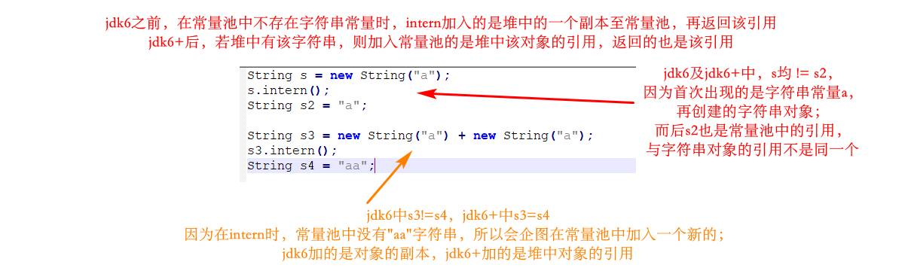
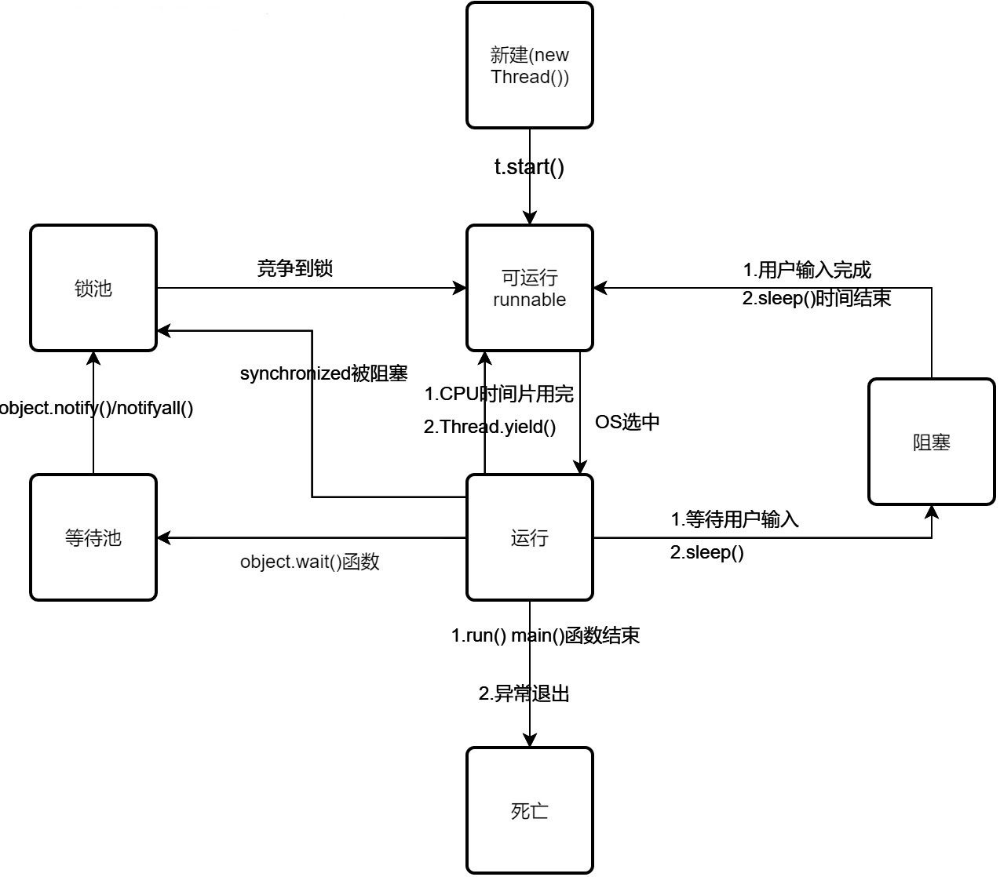

# 2. 网络

ip+协议+端口（socket)，标识网络中的一个进程

### 三次握手
syn . syn+ack.  ack  
意义：
获得初始化的seq号；  
syn flood：客户端不断发送syn但不回复syn+ack，造成服务端syn队列满，无法正常连接（解决：syn cookies）

### time_wait的意义
让服务端有足够时间收到ack；
避免和新连接混淆

### 为什么挥手要四次
全双工，客户和服务都得发送fin和ack

大量close_wait（占用文件句柄 to many open files）：
对方关闭连接，fin请求收到，但本方未关闭（未正常关闭资源）。所以一直是close_wait，仍然可以发数据给对方

UDP面向报文，不作拆分合并

TCP滑动窗口

HTTP无连接（传送完即断开连接）无状态

### 输入URL回车后
1. DNS解析
2. TCP连接
3. HTTP请求
4. HTTP响应
5. 浏览器解析
6. 关闭连接

### GET和POST的区别
1. GET放在URL，POST放在报文体
2. 数据库：GET幂等性和安全性，POST无
3. GET可以被缓存，POST不行

### SESSION的实现方式
1. Cookie实现，回复给客户端一个sessionId做cookie
2. URL回写

### HTTPS数据传输流程
1. ........


# 4. Redis

### Memcache
1. 类似hash
2. 只有简单数据类型
3. 不能持久化
4. 不支持主从
5. 不支持分片

### 为什么redis快
1. 内存
2. 数据结构简单
3. 单线程，没有上下文切换，锁竞争
	- CPU一般不是Redis的性能瓶颈，一般都是网络因素
4. 多路IO复用(selector)，非阻塞IO
	- 复用函数epoll/kqueue/evport/select
	- 优先选择o(1)的函数
	- o(n)的函数保底
	- 基于react设计模式监听IO事件

### redis数据类型
1. String： 二进制安全，最长512M	
	```
	字符串对象的结构
	struct sdshdr {
		int len; //buf 中已用的长度
		int free; //buf 中可用的长度
		char buf[]; //数据空间
	}	
	```
2. Hash 
3. List（有序）
4. Set（无序），可求交并差集
5. Sorted Set，有序，排序依据是分数
6. HyperLogLog, Geo

### redis实现分布式锁
1. setnx实现互斥，expire设置过期时间（即释放锁）
	```
	long status = jedis.setnx(key, "xx");
	
	if(status == 1){
		jedis.expire(key, expire);
		doJob();
	}
	```
	缺点：setnx和expire分开执行了，破坏了原子性，可能会造成expire不执行，发生死锁
2. 避免以上缺点，将set和expire操作合成原子性，即在set操作里设置过期时间
	```
	SET key value [EX sec] [PX] [NX|XX]
	```

大量key同时过期，清除大量key很耗时，会短暂阻塞，解决：
1. 随机设置key过期时间

### redis做异步队列
1. rpush和lpop
	- 缺点：不会等待，调用pop即立即消费；可在应用程序里sleep做控制
	- blpop key [timeout]：阻塞timeout秒直到队列里有数据才返回
	- 只能一个消费者消费，多个消费者可使用订阅模式

### redis持久化rdb
1. bgsave是fork子进程进行备份，并利用了写时复制，即：
	- 多个调用者调用相同的资源（内存或外存等），则共同获取相同的指针，直到某个调用者试图修改资源，系统才会真正复制一个副本给该调用者。所以子进程在备份时，父进程对数据进行的修改，都是在副本里修改的，子进程相当于拥有一个快照
2. 缺点：全量备份，数据大时，由于I/O会严重影响性能；只保存了最后一次快照的数据，之后的数据没有备份到

aof重写备份文件，**见书**
 
主从同步的详细步骤，**见书（全量同步，增量同步）**

### 哨兵
解决主从同步的master宕机的主从切换问题（流言协议，投票确定新的master）

### 分片
以节点数为模确定数据应该在的节点；无法动态变化

### 集群
其实就是相比分片，在hash时采用了**一致性hash算法**（哈希环，考虑增减服务器所带来的影响？？），以达到动态扩展的目的。
哈希环数据倾斜问题：节点少，且在环上，分布不均匀，这时候数据就会集中在某一节点上（引入虚拟节点使其分布均匀，解决此问题） 


# 5. Linux

### 用户态和内核态
1. 内核本质是一段管理计算机硬件的程序
2. 内核的访问接口就是系统调用，不能再简化
3. 系统调用的组合就是公用函数库
4. shell是命令解释器

### 找特定文件
`find path [options] params`, 如：
1. `find / -name "xxx.java"`(-iname 不区分大小写)
2. `man find`查看手册

### 检索文件内容
1. `grep [options] pattern file`
2. `grep -o`只输出匹配的那部分内容，而不是整行

### 管道注意点
1. 右边命令只处理左边命令的正确输出，不处理错误输出
2. 右边命令必须能够接受标准输入流，否则数据流被丢弃

### 统计命令
1. `awk`，将每行按照分割符做切片，`-F`指定分隔符
2. 统计每行出现的次数：`| awk '{arr[$1]++}END{for(i in arr)print i "\t" arr[i]}'`

### 批量替换文本内容
1. `sed`，`sed -i 's/Str/String/g xxx.java`

# 6. Java

### java的理解
1. 平台无关性
2. GC
3. 语言特性：泛型反射等
4. 面向对象
5. 类库
6. 异常处理

### 平台无关性
1. javac编译成字节码，javap可反编译，java运行class文件
2. java提供了不同平台的jvm，不同jvm对同一字节码文件生成不同的执行指令

### 反射
在运行状态中，对任意一个类，都能动态获取其属性和方法；对任意一个对象，都能动态调用其属性和方法，例如：
 	
```
public class Robot {
	private String name;
	public void sayHi(String helloSentence){
	    System.out.println(helloSentence + " " + name);
	}
	private String throwHello(String tag){
	    return "Hello " + tag;
	}
	static {
	    System.out.println("Hello Robot");
	}
}
```
```
Class rc = Class.forName("com.interview.javabasic.reflect.Robot");
Robot r = (Robot) rc.newInstance();

Method getHello = rc.getDeclaredMethod("throwHello", String.class);
getHello.setAccessible(true);
Object str = getHello.invoke(r, "Bob");

Method sayHi = rc.getMethod("sayHi", String.class);
sayHi.invoke(r, "Welcome");

Field name = rc.getDeclaredField("name");
name.setAccessible(true);
name.set(r, "Alice");

System.out.println(System.getProperty("java.ext.dirs"));
System.out.println(System.getProperty("java.class.path"));

```


### ClassLoader
1. BootStrapClassLoader：C++编写，加载核心库
2. ExtClassLoader：java编写，加载扩展库
3. AppClassLoader：java编写，加载程序所在目录的class
4. 自定义
	- 覆盖findClass和defineClass方法，具体见书

### 双亲委派机制
自底向上检查类是否已加载，自顶向下尝试加载类，代码架构可简化为如下：
	
```
Class loadClass(){
	c = findLoadedClass();  //是否已加载
	if(c == null){
		if(parent != null){ //若有父加载器
			c = parent.loadClass();  //体现自顶向下加载原则
		}else //说明是BootStrapClassLoader
			c = findBootStrapClass();
		
		if( c == null){ //若父加载器无法加载
			c = findClass(); //用本加载器加载
		}
	}else
		return c;
}
```
### 为什么需要双亲委派机制
- 避免多份同样字节码的加载

隐式加载：new  
显式加载：loadClass，forName,获取到class对象再newInstance，但此构造方式不能传递参数

### loadClass和forName的区别
类的装载过程
1. ClassLoader将class文件字节码转换成Class对象
2. 链接：
	- 校验：检查正确性和安全性
	- 准备：分配空间，设置默认值
	- 解析：符号引用转换成直接引用
3. 初始化：执行类中的static代码块和变量赋值

forName会对类进行链接和初始化，所以mysql在加载驱动时用的都是forName；loadClass只会生成一个class对象，不会进行链接和初始化

### 内存模型
操作数栈和局部变量表的交互，**见书**

StackOverflowError异常：递归过深，栈帧数超出虚拟机栈深度  
OutOfMemoryError异常：虚拟机栈过多引发，即线程过多

元空间（方法区）和永久代的区别：
- 元空间使用本地内存（只受机器的内存限制），永久代使用jvm的内存，所以经常看到的是永久代的内存溢出

元空间的优势：
- jdk6前的字符串常量池在永久代中，容易溢出
- 类和方法的信息大小难确定，永久代大小不好确定
- 永久代给gc带来麻烦

内存调优参数（-Xms, -Xmx, -Xss）:
- Xss, 每个线程虚拟机栈的大小
- Xms, 堆的初识大小
- Xmx, 堆的最大大小

内存分配策略：
- 静态存储：编译时确定空间需求
- 栈式存储：编译时未知，在运行时模块入口前才知道
- 堆式存储：编译时或运行模块入口前都无法确定，动态分配

堆和栈的区别：
- 栈在作用域结束时自动释放内存，堆需要gc
- 栈比堆小
- 栈内存碎片远小于堆
- 栈支持静态和动态分配，堆只能动态分配
- 栈效率比堆高

不同版本的intern()方法的区别：
- jdk6：如果字符串常量池中已经包含等于此对象的字符串，则返回池中的对象；否则，将新的String对象字符串添加至常量池中，并返回此对象的引用
- jdk6+：不同的是，池中没有相等的字符串对象时，先检查堆中有没有，若有，则将堆中的对象的引用加入池中，返回该引用；若无，才是将新的String对象字符串添加至常量池中，并返回此对象的引用

intern()方法的例子：
```
String s = new String("a");
s.intern();
String s2 = "a";

String s3 = new String("a") + new String("a");
s3.intern();
String s4 = "aa";
```


# 7. 垃圾回收

### 对象被判断为垃圾的标准
- 没有被其他对象引用
	- 引用计数算法
		- 优点：执行效率高，程序受影响小
		- 缺点：无法检测出循环引用
	- 可达性分析算法
		- 可作为gc root的对象
			- 虚拟机栈中引用的对象（局部变量表中的引用）
			- 本地方法栈中引用的对象
			- 方法区中常量引用的对象
			- 方法区中类静态属性引用的对象
			- 活跃线程的引用对象

### 垃圾回收算法
- 标记清除
	- 标记可达的，回收不可达的
	- 碎片太多
- 复制算法
	- eden区和survival区应用
		- 解决碎片化
		- 顺序分配
		- 适用于对象存活率低（新生代）
- 标记整理
	- 标记可达的存活对象，移动到一起，再清除后面的内存
		- 解决碎片化
		- 适用于对象存活率高（老年代）

### 对象进入老年代
- 经过N次minor gc依然存活
- survivor区中放不下的对象
- 新生成的大对象

### 触发FULL GC
- 老年代空间不足
- 永久代空间不足 jdk7以前的版本
- CMS GC时某些特殊情况
- Minor GC晋升到老年代对象的平均大小大于老年代剩余空间（为保证老年代有足够的空间）
- 显示调用System.gc()，但不一定触发GC
- RMI/RPC

### **几种常见的GC器**

### finalize()和C++的析构函数的不同
1. 析构函数是确定的，finalize()不确定
2. 未被引用的对象放在F-Queue队列中，等待执行finalize
3. finalize方法随时可能被终止
4. 作用是给对象最后一次逃脱GC的机会

### **四种引用的区别和引用队列的使用**，见书

# 8. 进程线程

### 进程线程**区别，描述**

### start和run方法
- start通过jvm的jvm_startThread创建了线程，并找到线程入口thread_entry开始执行（即run方法）
- run方法只是一个方法，直接调用它不创建线程

### Thread和Runnable
- Thread是一个类，Runnable是一个接口，其中只有一个run方法，Thread实现了Runnable接口

### 线程的返回值
给run()方法传参：
- 构造函数传参
- 成员变量传参
- 回调函数传参

处理线程的返回值：
- 主线程等待法：主线程一直循环，等待子线程的某个标志发生变化，再继续处理数据
	- 缺点：需要一直循环等待，不能精确控制时间，代码也复杂
- Thread.join()方法：阻塞当前线程以等待子线程处理完毕
- Callable接口实现：FutureTask类或者线程池获取 
	- `task = new FutureTask(new Callable<V>(){ V call();}); new Thread(task).start; task.get()`
	- `Future<V> f = threadPool.sumbit(new Callable(){ V call();}); f.get()`

### 线程的状态
- 新建。创建未启动
- 运行。包含Running和ready
- 无限期等待。需要被显示唤醒
	- 无参数的wait()和join()方法
	- park()方法
- 限期等待。一定时间后系统自动唤醒
	- 有参数的wait()和join()方法
	- Thread.sleep(timeout)方法
	- parkNanos()和parkUntil()
- 阻塞。等待获取锁的线程
- 结束。线程结束执行，线程执行完后再执行start()方法会报错

### sleep和wait的区别
- sleep是Thread的方法，wait是Object的方法
- sleep只会让出CPU，不会释放锁；wait不仅会让出CPU，还会释放锁（在同步锁代码块内）

### notify和notifyall的区别

- 锁池EntryList：其他线程进入锁池等待锁的释放
- 等待池WaitList：线程释放了对象的锁并阻塞(wait方法)，进入该对象的等待池中，不去竞争锁
- notifyALL让所有等待池中的线程全部进入锁池去竞争锁
- notify只随机选一个等待池中的线程进入锁池去竞争

### yield
会给线程调度器一个当前线程愿意让出cpu的指示，不一定会让出CPU，最终决定权还是在线程调度器中

### interrupt
- 若线程处于被阻塞状态，则立即退出并抛出一个InterruptedException异常
- 若线程处于活动状态，则将线程的中断标志设为true，线程继续运行不受影响
	- 可以通过`Thread.currentThread().isInterrupted()`函数去轮询中断标志，若为true则结束任务

### 线程的状态转换图



# 9. 多线程相关

### synchronized底层实现原理


# 10. 类库

### String,StringBuffer, StringBuilder区别

### 异常
异常回答了三个问题：
- what. 异常类型
- where. 异常堆栈跟踪
- why. 异常信息

异常体系：
- Error. JVM负担的责任
	- NoClassDefFoundError
	- StackOverflowError
	- OutOfMemoryError
- RuntimeException. 程序应该负担的责任
	- 空指针
	- 类型转换错误
	- 传递非法参数
	- 下标越界
	- 数字格式
- Checked Exception. 编译器负担的责任
	- ClassNotFoundException
	- IO异常

ClassNotFoundException和NoClassDefFoundError区别：
- Exception类型	**VS** Error类型
- 显式加载Class的时候找不到类 **VS** 编译成功以后执行过程中Class找不到(如编译new XXX()成功后，删除对应的class文件再运行)
- 一般在执行Class.forName()、ClassLoader.loadClass()或ClassLoader.findSystemClass()时抛出 **VS **由JVM的运行时系统抛出，是不成功的隐式类装入的结果