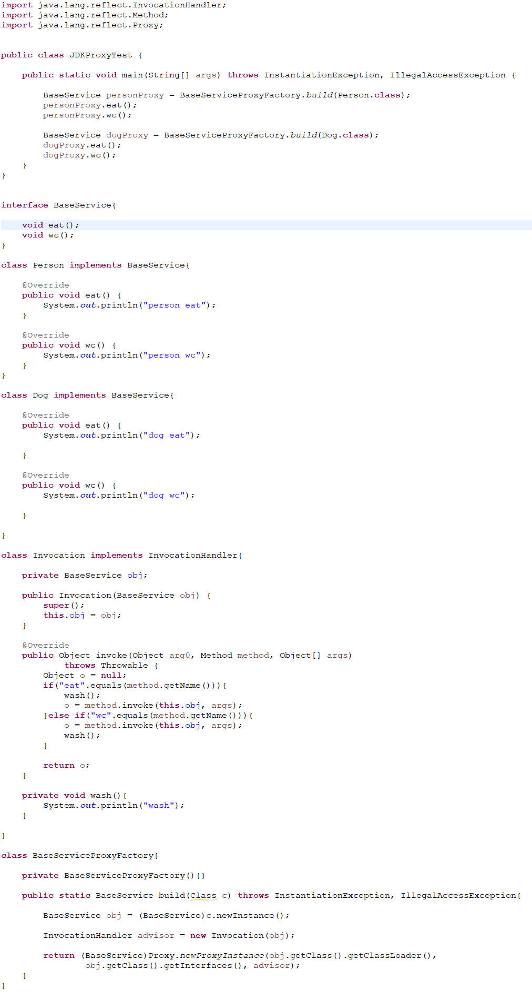

# 1. Mybatis

### 1.1 MyBatis框架执行流程
1. 读取核心配置文件和映射文件
2. 创建工厂，存储Configuration对象
	- SqlSessionFactoryBuilder().build(InputStream in)
	- 返回的factory中就包含了Configuration对象
3. 创建SqlSession对象提供属性
  	- Configuration对象
    - dirty
    	- true：sql语句执行完毕后，可以事务提交
        - false：sql语句执行发送错误，事务进行回滚
    - Executor执行器对象
        - 创建Statement对象，在创建过程中依靠MapperStatement对象将赋值内容与sql占位符进行绑定
4. SqlSession.commit()；根据此时dirty属性决定提交和回滚
5. SqlSession.close(); 将连接返回至连接池

### 1.2 自定义类型转换器

### 1.3 自定义对象工厂

### 1.4 自定义拦截器

可以自定义拦截的接口只有四种：
- Executor
- StatementHandler
- ParameterHandler
- ResultHandler

### 1.5 代理模式

见视频第三课，一个小型的mybatis框架，主要运用到的是代理模式

### 1.6 Mapper配置文件详解

- #{}和 ${}的区别
	- #{} : 采用预编译方式,可以防止SQL注入
 	- ${} : 采用直接赋值方式,无法阻止SQL注入攻击；但可使用于动态指定表名，动态的指定查询中的排序字段，都只能用${}
- resultMap,对象名和库名不一致，需要map
- sql标签，`<include>` 

### 1.7 动态SQL

- if
- choose/when/otherwise，相当于switch/case/default
- where 动态指定查询条件
- set 动态指定更新字段
- trim 替换if语句中前后缀多出来的内容