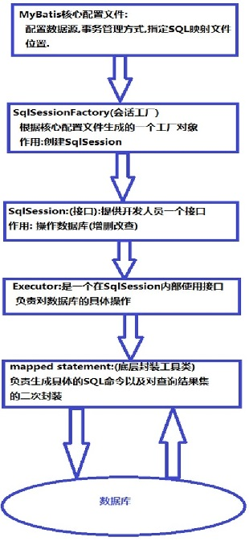

# 1. Mybatis

MyBatis框架执行流程
1. 读取核心配置文件和映射文件
2. 创建工厂，存储Configuration对象
	- SqlSessionFactoryBuilder().build(InputStream in)
	- 返回的factory中就包含了Configuration对象
3. 创建SqlSession对象提供属性
  	- Configuration对象
    - dirty
    	- true：sql语句执行完毕后，可以事务提交
        - false：sql语句执行发送错误，事务进行回滚
    - Executor执行器对象
        - 创建Statement对象，在创建过程中依靠MapperStatement对象将赋值内容与sql占位符进行绑定
4. SqlSession.commit()；根据此时dirty属性决定提交和回滚
5. SqlSession.close(); 将连接返回至连接池

