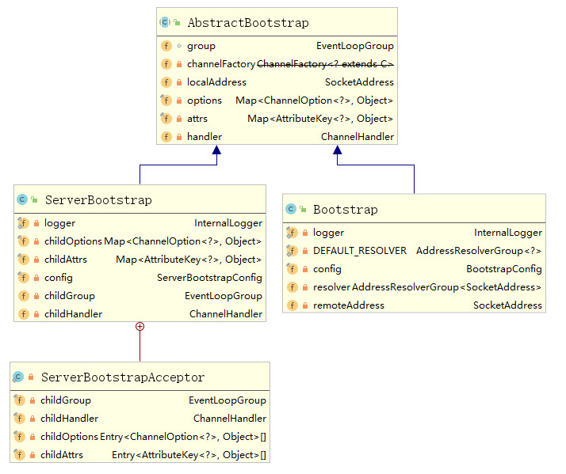
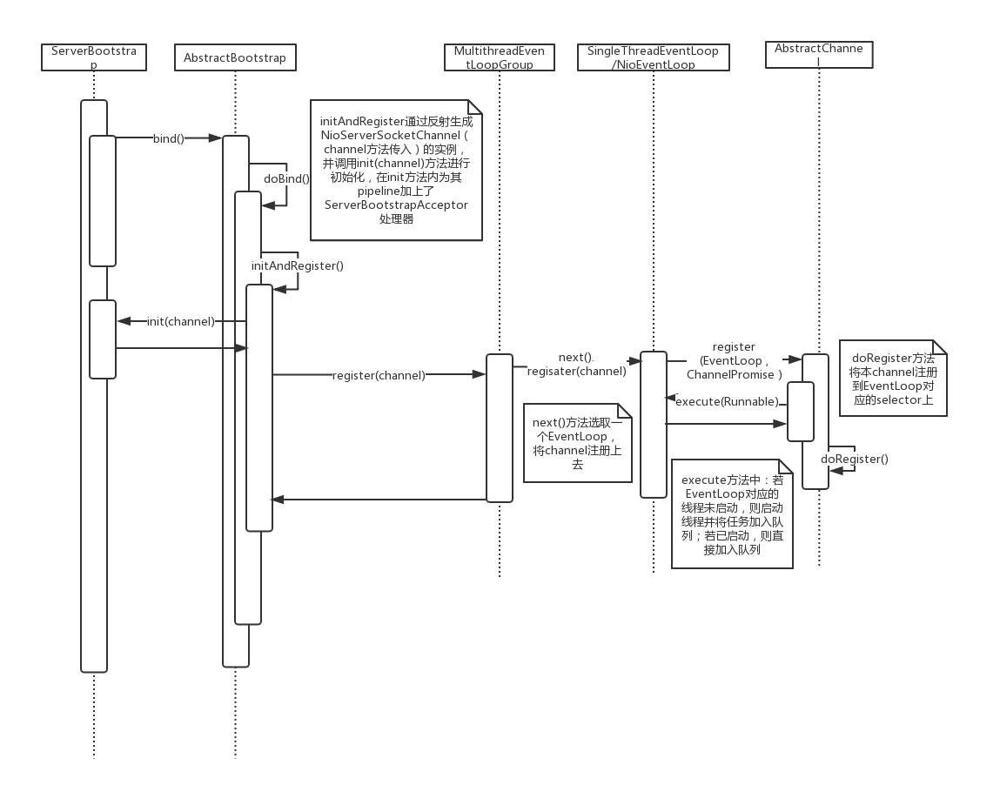
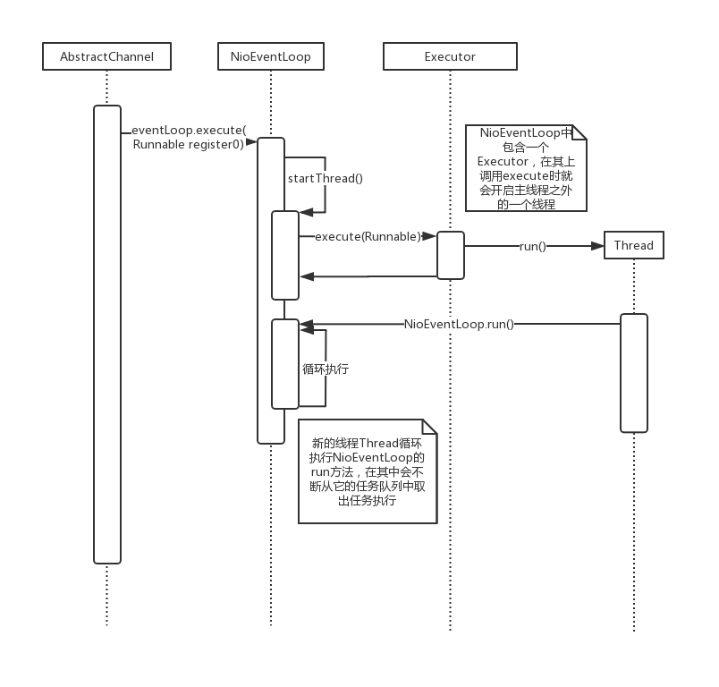
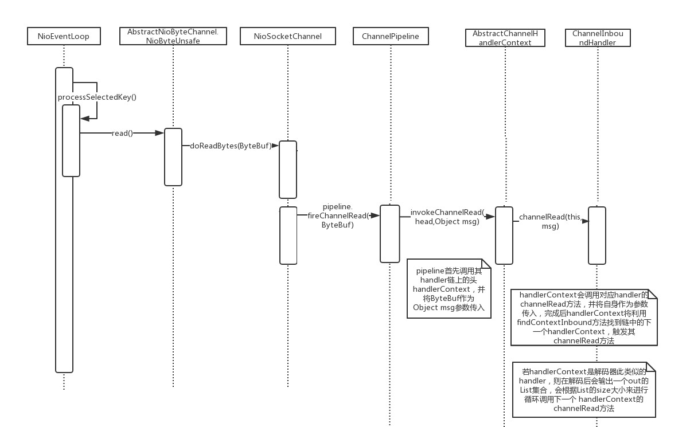
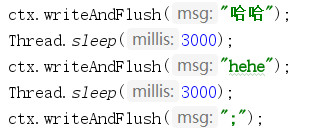
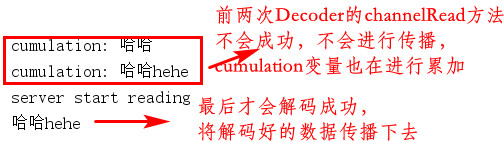
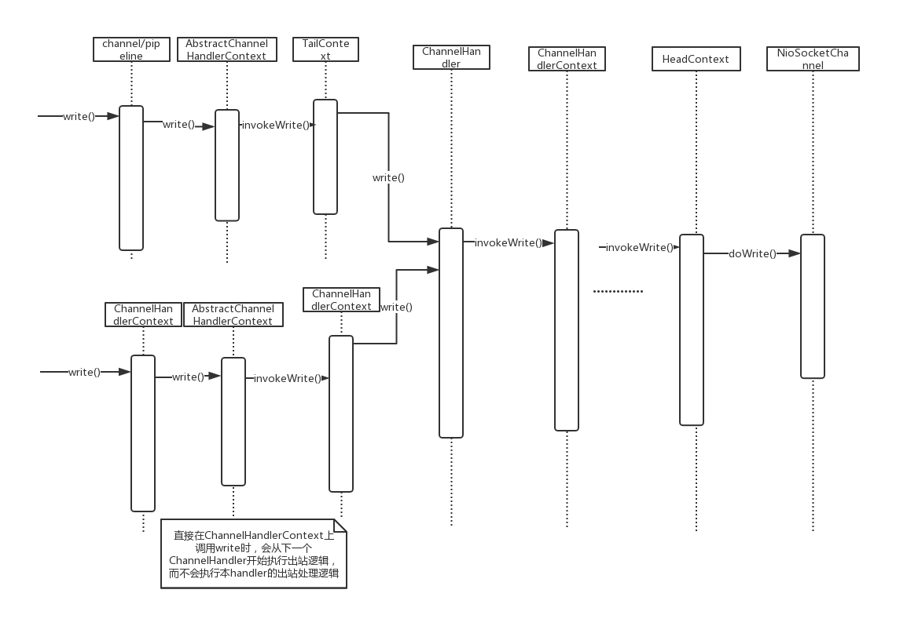

[TOC]

channel在注册到EventLoop上（具体就是注册到对应的selector上）时，会触发handler的channelRegistered()方法，在其中会对initChannel()方法进行调用。所以，一般都是先将一个ChannelInitializer先加入至channel中，在channel注册时触发initChannel()将其他Handler也加入

#### Netty线程模型

Netty4 无锁串行化设计，即每个channel都只有一个EventLoop和线程对之处理，避免了线程切换带来的开销

#### ServerBootStrap启动流程分析

AbstractBootstrap、ServerBootstrap、Bootstrap类图（其中有ServerBootstrap的内部类ServerBootstrapAcceptor）



ServerBootstrap的init(Channel)方法中（注意加入ServerBootstrapAcceptor所用的方法）：

```java
p.addLast(new ChannelInitializer<Channel>() {
    @Override
    public void initChannel(Channel ch) throws Exception {
        final ChannelPipeline pipeline = ch.pipeline();
        ChannelHandler handler = config.handler();
        if (handler != null) {
            pipeline.addLast(handler);
        }

        // We add this handler via the EventLoop as the user may have used a ChannelInitializer as handler.
        // In this case the initChannel(...) method will only be called after this method returns. Because
        // of this we need to ensure we add our handler in a delayed fashion so all the users handler are
        // placed in front of the ServerBootstrapAcceptor.
        ch.eventLoop().execute(new Runnable() {
            @Override
            public void run() {
                pipeline.addLast(new ServerBootstrapAcceptor(
                        currentChildGroup, currentChildHandler, currentChildOptions, currentChildAttrs));
            }
        });
    }
});
```

启动时序图如下:



#### NioEventLoop开启和处理accept事件

NioEventLoop中都包含一个selector，channel注册到的selector指的就是NioEventLoop中的selector

上述时序图可概括为：

1. ServerBootstrap开启bind事件，init进行初始化，生成通道，设置参数等
2. register过程中，会开启NioEventLoop的线程
3. 线程处理task，即对应图中的execute(Runnable)，其中一个task就是doRegister()，将通道注册到selector
4. 由于channel是先注册到NioEventLoop上（即先执行doRegister()任务，先被注册到selector上），才会触发channel上ChannelInitializer的initChannel方法，才会执行 将ServerBootstrapAcceptor加入pipeline的任务

NioEventLoop线程启动的详细过程：



在ServerBootstrapAcceptor中，其`channelRead(ChannelHandlerContext ctx, Object msg)`方法传入的消息的类型其实就是一个Channel类型，代表accept之后获取到的SocketChannel。之后只需要类似的，将childHandler加入其pipeline，并且将其注册到childGroup上（过程类似parentGroup，会将channel注册到对应的selector上去）即可

#### NioEventLoop接收客户端数据过程

数据在ChannelHandler中的流动过程时序图：



#### 读半包处理分析

主要在于ByteBuf类型的cumulation变量，在无法按给定的规则进行解码时，本次调用的channelRead()方法中对数据的解码不会成功，所以其List输出列表out将为空，故不会传播至下一个handlerConntext，且会将本次读取到的原始数据加入cumulation变量；至此，NioEventLoop.run()的一次循环完成，下一次循环中，会对cumulation变量继续进行累加，直至达到解码规则的要求；一旦可以解码，其out列表就不为空，就会传播至下一个handlerConntext，并且会将已解码的数据进行释放。

举例：

客户端分段进行数据发送：



服务端以";"为分隔符进行解码：



#### 写数据write过程

过程从write方法开始，其数据流动过程与读数据类似，数据的解码也是在write方法中。与读数据有一点不同的是，大部分地方都需要对返回的ChannelFuture类或者Promise类的参数进行额外处理；还有就是读数据是从HeadContext类开始，若是channel或pipeline调用的write方法，则写数据是从TailContext类开始，但若是直接在handlerContext中调用write方法，就直接从下一个handlerContext开始流动数据。而且ChannelOutboundHandler链的最后一个必定是HeadContext，故真正的向channel中写入字节数据是在HeadContext类中完成的



