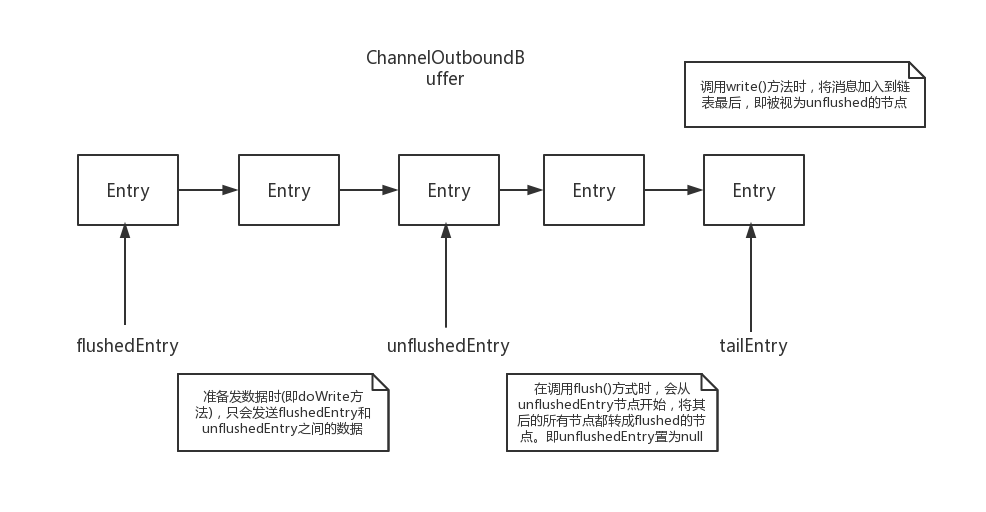

netty源码分析参考：[https://segmentfault.com/a/1190000007403873](netty源码分析参考)

[TOC]

channel在注册到EventLoop上（具体就是注册到对应的selector上）时，会触发handler的channelRegistered()方法，在其中会对initChannel()方法进行调用。所以，一般都是先将一个ChannelInitializer先加入至channel中，在channel注册时触发initChannel()将其他Handler也加入

#### Netty线程模型

Netty4 无锁串行化设计，即每个channel都只有一个EventLoop和线程对之处理，避免了线程切换带来的开销

#### ServerBootStrap启动流程分析

AbstractBootstrap、ServerBootstrap、Bootstrap类图（其中有ServerBootstrap的内部类ServerBootstrapAcceptor）


ServerBootstrap的init(Channel)方法中（注意加入ServerBootstrapAcceptor所用的方法）：

```java
p.addLast(new ChannelInitializer<Channel>() {
    @Override
    public void initChannel(Channel ch) throws Exception {
        final ChannelPipeline pipeline = ch.pipeline();
        ChannelHandler handler = config.handler();
        if (handler != null) {
            pipeline.addLast(handler);
        }

        // We add this handler via the EventLoop as the user may have used a ChannelInitializer as handler.
        // In this case the initChannel(...) method will only be called after this method returns. Because
        // of this we need to ensure we add our handler in a delayed fashion so all the users handler are
        // placed in front of the ServerBootstrapAcceptor.
        ch.eventLoop().execute(new Runnable() {
            @Override
            public void run() {
                pipeline.addLast(new ServerBootstrapAcceptor(
                        currentChildGroup, currentChildHandler, currentChildOptions, currentChildAttrs));
            }
        });
    }
});
```

启动时序图如下:


#### NioEventLoop开启和处理accept事件

NioEventLoop中都包含一个selector，channel注册到的selector指的就是NioEventLoop中的selector

上述时序图可概括为：

1. ServerBootstrap开启bind事件，init进行初始化，生成通道，设置参数等
2. register过程中，会开启NioEventLoop的线程
3. 线程处理task，即对应图中的execute(Runnable)，其中一个task就是doRegister()，将通道注册到selector
4. 由于channel是先注册到NioEventLoop上（即先执行doRegister()任务，先被注册到selector上），才会触发channel上ChannelInitializer的initChannel方法，才会执行 将ServerBootstrapAcceptor加入pipeline的任务

NioEventLoop线程启动的详细过程：


在ServerBootstrapAcceptor中，其`channelRead(ChannelHandlerContext ctx, Object msg)`方法传入的消息的类型其实就是一个Channel类型，代表accept之后获取到的SocketChannel。之后只需要类似的，将childHandler加入其pipeline，并且将其注册到childGroup上（过程类似parentGroup，会将channel注册到对应的selector上去）即可

#### NioEventLoop接收客户端数据过程

数据在ChannelHandler中的流动过程时序图：


read()方法主要做的事情：

1. 分配 ByteBuf
2. 从 SocketChannel 中读取数据，doReadBytes方法
3. 调用 **pipeline.fireChannelRead** 发送一个 inbound 事件

#### 读半包处理分析

主要在于ByteBuf类型的cumulation变量，在无法按给定的规则进行解码时，本次调用的channelRead()方法中对数据的解码不会成功，所以其List输出列表out将为空，故不会传播至下一个handlerConntext，且会将本次读取到的原始数据加入cumulation变量；至此，NioEventLoop.run()的一次循环完成，下一次循环中，会对cumulation变量继续进行累加，直至达到解码规则的要求；一旦可以解码，其out列表就不为空，就会传播至下一个handlerConntext，并且会将已解码的数据进行释放。

举例：

客户端分段进行数据发送：


服务端以";"为分隔符进行解码：


#### 写数据write过程

过程从write方法开始，其数据流动过程与读数据类似，数据的解码也是在write方法中。与读数据有一点不同的是，大部分地方都需要对返回的ChannelFuture类或者Promise类的参数进行额外处理；还有就是读数据是从HeadContext类开始，若是channel或pipeline调用的write方法，则写数据是从TailContext类开始，但若是直接在handlerContext中调用write方法，就直接从下一个handlerContext开始流动数据。而且ChannelOutboundHandler链的最后一个必定是HeadContext，故真正的向channel中写入字节数据是在HeadContext类中完成的


每个写入的消息在ChannelOutboundBuffer内部都会被封装成一个Entry对象。在write()方法调用时，会调用addMessage()方法，加入的消息就是unflushed的Entry，即不会被发送出去的消息。只有在调用flush()方法后，addFlush()方法会将当前链表中所有unflushed的消息变成flushed，即会被发送出去。`unflushedEntry`指针表示unflush消息的头节点：



#### 写半包处理分析

```java
ByteBuffer nioBuffer = nioBuffers[0];
for (int i = config().getWriteSpinCount() - 1; i >= 0; i --) {
    final int localWrittenBytes = ch.write(nioBuffer);
    if (localWrittenBytes == 0) {
        setOpWrite = true;
        break;
    }
    expectedWrittenBytes -= localWrittenBytes;
    writtenBytes += localWrittenBytes;
    if (expectedWrittenBytes == 0) {
        done = true;
        break;
    }
}
```

```java
in.removeBytes(writtenBytes);

if (!done) {
    // Did not write all buffers completely.
    incompleteWrite(setOpWrite);
    break;
}
```

每次的doWrite()内部会计算实际发送出去的数据大小，若与期望的数据大小不一致时（即可能某次发送没有成功），会调用incompleteWrite方法，该方法将一个flush()的task加入任务队列，该任务会调用flush刷新数据，并再一次的触发doWrite()方法，尝试将数据写出去

#### NioEventLoop详细分析

通过反射，Netty将原nio包下的selector类中的selectedKeys域设置成了自定义的`SelectedSelectionKeySet`类型的`Set<SelectionKey>`集合，SelectedSelectionKeySet带有自动扩容机制（类似HashMap的双倍扩容机制），使其处理更高效

##### NioEventLoopGroup 实例化过程

- EventLoopGroup(其实是MultithreadEventExecutorGroup) 内部维护一个类型为 EventExecutor children 数组, 其大小是 nThreads, 这样就构成了一个线程池
- 如果我们在实例化 NioEventLoopGroup 时, 如果指定线程池大小, 则 nThreads 就是指定的值, 反之是处理器核心数 * 2
- MultithreadEventExecutorGroup 中会调用 newChild 抽象方法来初始化 children 数组
- 抽象方法 newChild 是在 NioEventLoopGroup 中实现的, 它返回一个 NioEventLoop 实例.
- NioEventLoop 属性:
  - SelectorProvider provider 属性: NioEventLoopGroup 构造器中通过 SelectorProvider.provider() 获取一个 SelectorProvider
  - Selector selector 属性: NioEventLoop 构造器中通过调用通过 selector = provider.openSelector() 获取一个 selector 对象

##### NioEventLoop

主要继承关系：

```java
NioEventLoop -> SingleThreadEventLoop（实现了任务队列的功能，可向队列中添加task） -> SingleThreadEventExecutor -> AbstractScheduledEventExecutor（实现schedule定时功能）
```

NioEventLoop 的两种职责（主要在run方法中）：

- 作为 IO 线程, 执行与 Channel 相关的 IO 操作, 包括 调用 select等待就绪的 IO 事件、读写数据与数据的处理等（processSelectedKeys方法）
- 作为任务队列, 执行 taskQueue 中的任务（runAllTasks 方法）

当 taskQueue 中没有任务时, 那么 Netty 可以阻塞地等待 IO 就绪事件; 而当 taskQueue 中有任务时, Netty 会调用非阻塞的 selectNow() 方法, 以保证 taskQueue 中的任务尽快可以执行

##### 任务队列机制

EventLoop 可以通过调用 EventLoop.execute 来将一个 Runnable 提交到 taskQueue 中, 也可以通过调用 EventLoop.schedule 来提交一个 schedule 任务到 scheduledTaskQueue 中。在runAllTasks方法的一开始调用的 fetchFromScheduledTaskQueue() 其实就是将 scheduledTaskQueue 中已经可以执行的(即定时时间已到的 schedule 任务) 拿出来并添加到 taskQueue 中, 作为可执行的 task 等待被调度执行

#### Netty内存管理分析

参考[https://blog.csdn.net/chengzhang1989/article/details/80424556](netty内存管理源码分析)

