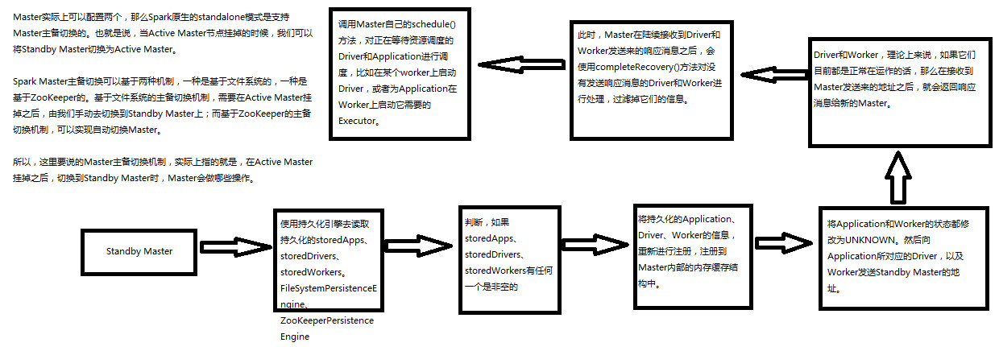
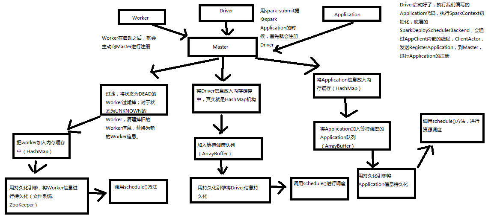
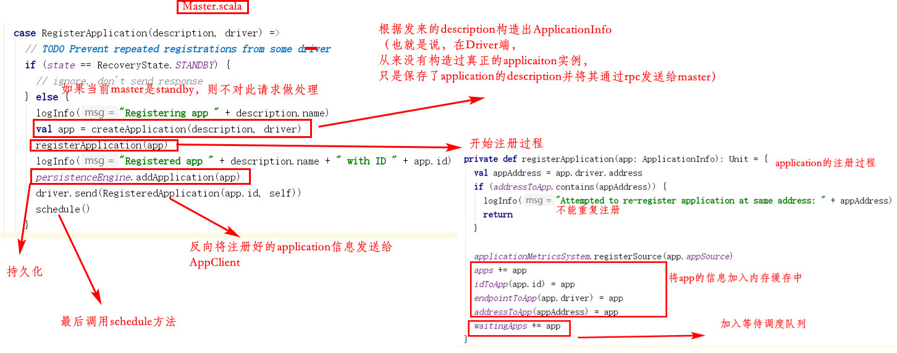

[TOC]

# 4. Master主备切换原理

两种切换机制：

- 基于文件系统。需手动切换
- 基于zk。自动切换

了解即可

# 5. Master注册机制分析

需要向Master注册的组件：Driver、Application、Worker

Master同ClientEndpoint一样继承自ThreadSafeRpcEndpoint类，ClientEndpoint是由AppClient内部创建的。表示，AppClient在注册application到master时，两端都是由ThreadSafeRpcEndpoint来负责通信的，即rpc调用

在AppClient中调用registerWithMaster()进行注册时，会继续调用tryRegisterAllMasters()方法，在此方法中，有语句`masterRef.send(RegisterApplication(appDescription, self))`，也就是会创建一个RegisterApplication对象发送给master。相应的，在Master中：

