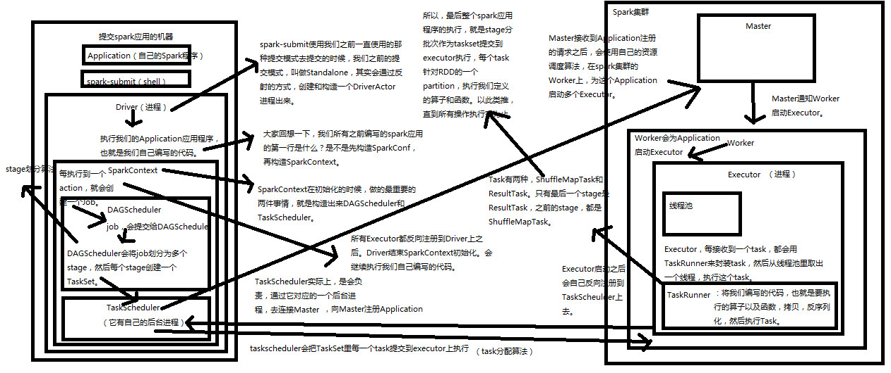
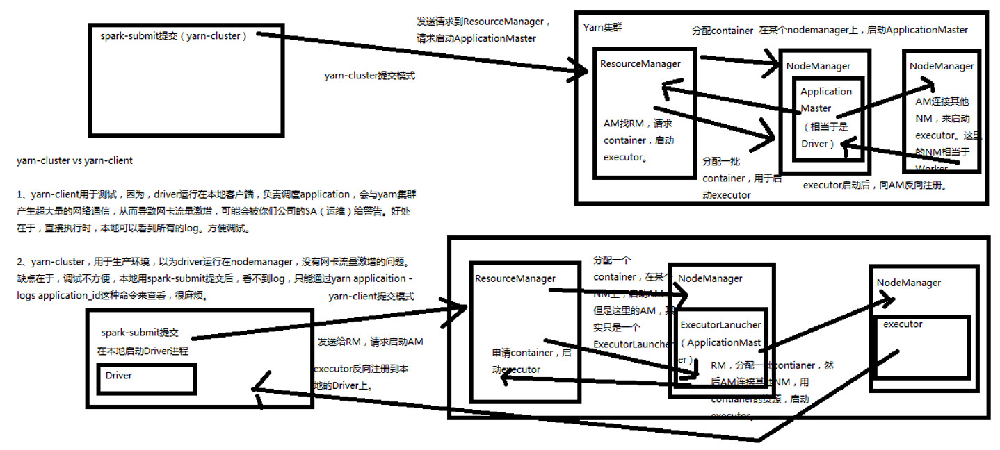
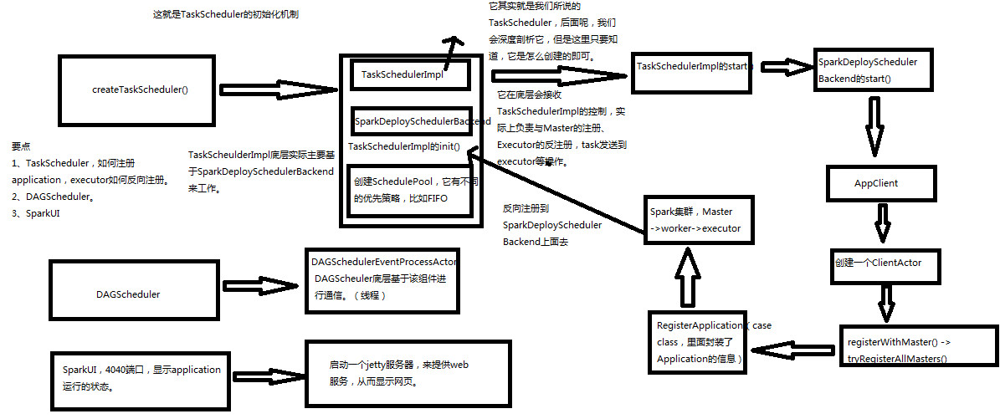
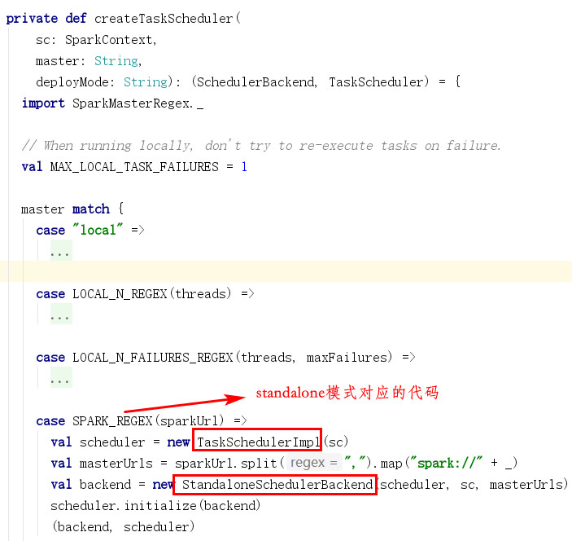
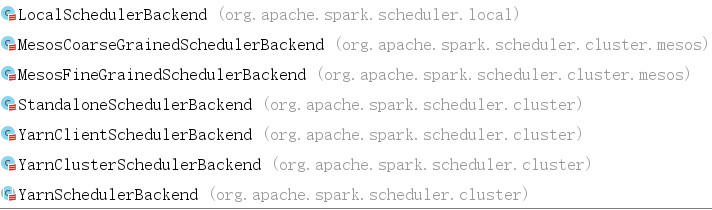
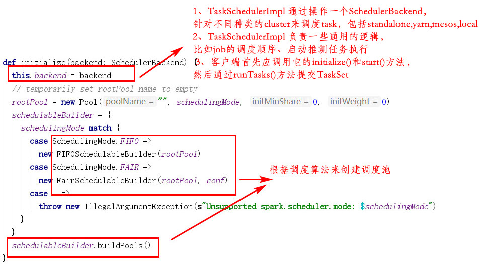
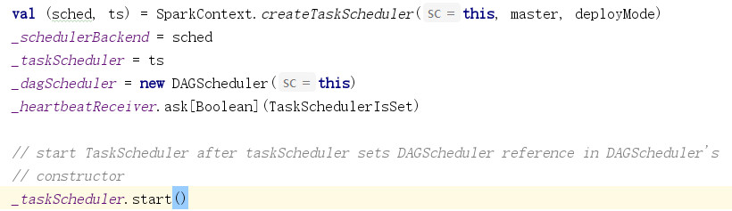
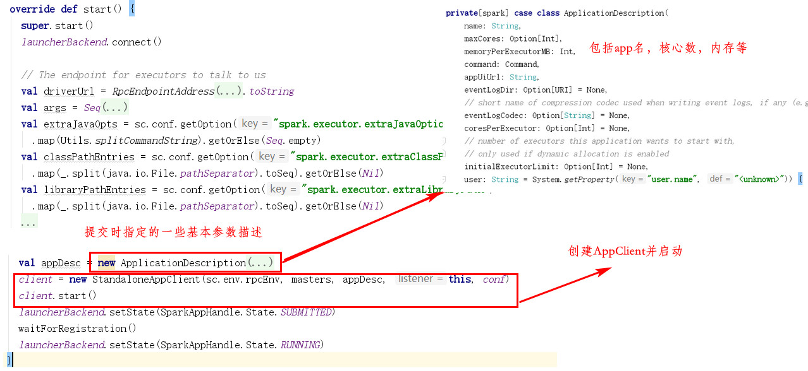
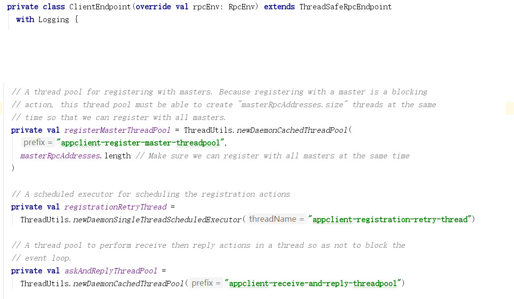

[TOC]

# 1. 内核架构

1. spark-submit以standalone方式提交后，会在相应的机器上通过反射机制创建出一个DriverActor进程
2. Driver进程内，开始初始化SparkContext
3. 初始化SparkContext过程中，构造DAGScheduler和TaskScheduler
4. TaskScheduler是另外一个进程，连接Master，注册提交的Applicaiton
5. Master使用自己的调度算法，在Worker上启动Executor进程
6. Executor启动后会反向将自己注册到TaskScheduler（Driver才能监控）
7. SparkContext初始化结束。开始执行功能代码
8. 每个action操作创建一个job，并提交给DAGScheduler
9. DAGScheduler将job划分成stage，每个stage创建对应的TaskSet，TaskSet传递给TaskScheduler
10. TaskScheduler将TaskSet中的每个Task提交（Task分配算法）到Executor
11. Executor用TaskRunner封装Task，从线程池中取一个线程执行一个Task（需将其反序列化）
12. 两种Task：ShuffleMapTask和ResultTask，只有最后一个stage为ResultTask（因为有action操作），每个Task针对RDD的partition执行

# 2. 两种提交模式比较

# 3. SparkContext原理

以上为1.3.0的版本，2.0版本此过程大致相同

源码分析：

1. 首先，SparkContext在初始化过程中，调用createTaskScheduler()方法，创建与提交模式匹配的SchedulerBackend和TaskScheduler

   

   

2. createTaskScheduler()方法中，在创建了TaskScheduler后，会调用其initialize()方法

   

3. TaskScheduler初始化完成后，在SparkContext内部会继续调用TaskScheduler的start()方法（中间有一个DAGScheduler的创建过程）

   

4. TaskScheduler的start()方法继续调用SchedulerBackend的start()方法，此方法中，在进行了一些参数准备后，会创建AppClient

   

5. AppClient负责application和spark集群的通信，会接收spark master的url（用于连接集群）、一个ApplicationDescription（此application的信息）、以及集群事件的监听器和监听器的回调函数

6. AppClient的start()方法会创建一个ClientEndpoint，它是一个RPC相关的类，它内部包含了执行代码所需要的线程池（此步骤与hadoop的rpc相关代码有些类似）

   

7. AppClient的start()方法会触发registerWithMaster()方法，开始向集群master注册application

8. 步骤3中，在TaskScheduler创建完成后，会创建DAGScheduler。SparkUI也是在SparkContext中创建的

9. DAGScheduler面向stage来进行调度，会为每个job计算stage的DAG图，寻找最优方案来运行job。将stage以tasksets的形式提交到TaskScheduler上（DAGScheduler还负责决定每个task的最佳运行位置，并将其告诉TaskScheduler），再由TaskScheduler提交其中的每个task

10. DAGScheduler会处理由shuffle输出文件丢失导致的失败，stage可能被重新提交；但是若不是由shuffle输出文件丢失导致的，则由TaskScheduler处理（重试每个task）
