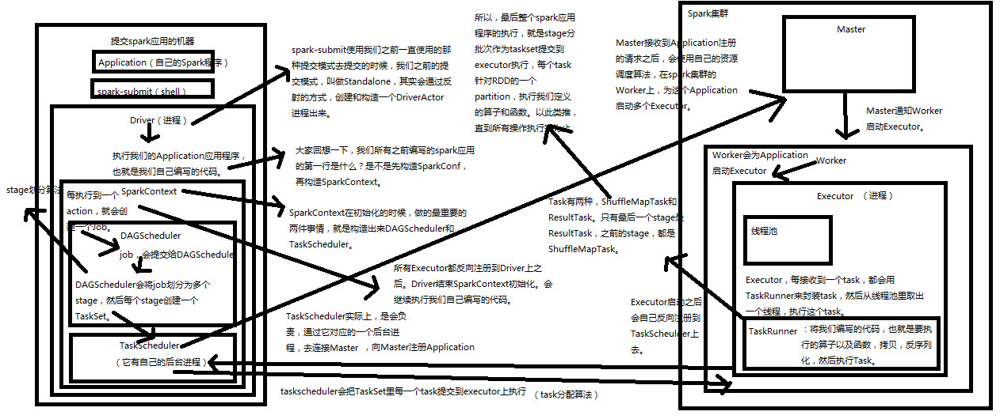

[TOC]

# 1. 内核架构

1. spark-submit以standalone方式提交后，会在相应的机器上通过反射机制创建出一个DriverActor进程
2. Driver进程内，开始初始化SparkContext
3. 初始化SparkContext过程中，构造DAGScheduler和TaskScheduler
4. TaskScheduler是另外一个进程，连接Master，注册提交的Applicaiton
5. Master使用自己的调度算法，在Worker上启动Executor进程
6. Executor启动后会反向将自己注册到TaskScheduler（Driver才能监控）
7. SparkContext初始化结束。开始执行功能代码
8. 每个action操作创建一个job，并提交给DAGScheduler
9. DAGScheduler将job划分成stage，每个stage创建对应的TaskSet，TaskSet传递给TaskScheduler
10. TaskScheduler将TaskSet中的每个Task提交（Task分配算法）到Executor
11. Executor用TaskRunner封装Task，从线程池中取一个线程执行一个Task（需将其反序列化）
12. 两种Task：ShuffleMapTask和ResultTask，只有最后一个stage为ResultTask（因为有action操作），每个Task针对RDD的partition执行

# 2.两种提交模式比较

