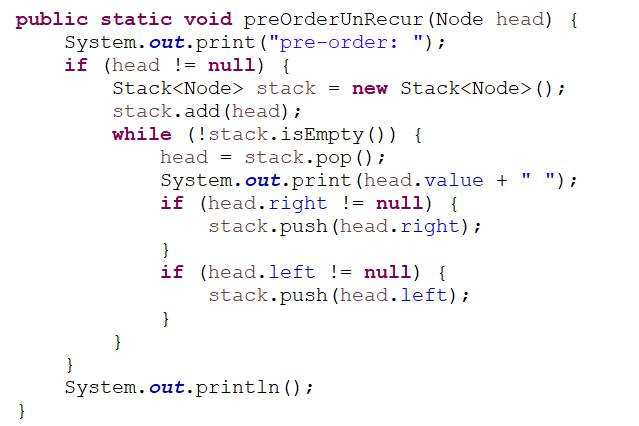
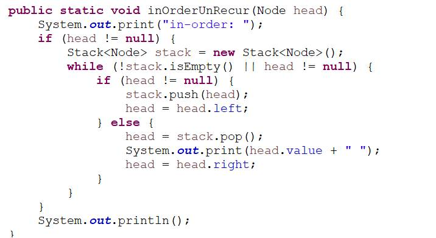
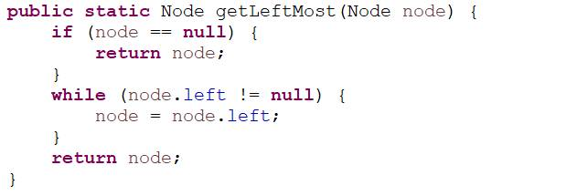
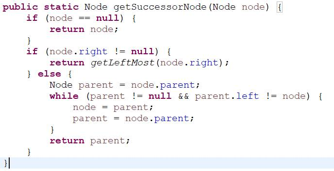

# 4
### 二叉树遍历
二叉树先序，中序，后序遍历，非递归和递归。见leetcode笔记

代码简洁版：

---
### 二叉树节点的后序节点
- 若节点有右子节点，则后序节点为右子节点的最左节点
	
- 若无，则往上找，一直找到此节点在某个祖先节点的左子树中

---
### 二叉树序列化反序列化
遍历，null用特殊字符代替，转换成字符串；反序列化的模型与序列化一样

### 判断平衡二叉树
