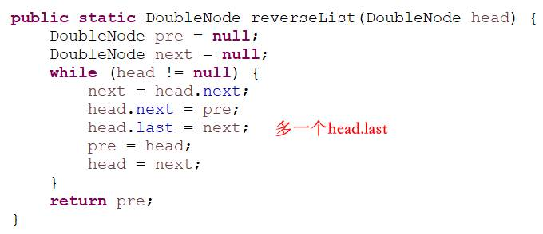

# 1
### 时间复杂度

---
### 冒泡排序

---
### 选择排序

---
### 插入排序

---
### 递归复杂度

---
### 归并排序

---
### 小和问题和逆序对问题

---

# 2
### 荷兰国旗问题（快排的基础）

---
### 快排
- 时间复杂度O(NlogN)， 额外空间复杂度O(logN)（**需记录哨兵的下标位置**）
- 经典快排
	- 只有小于等于区间和大于区间
	- 有小于区间，等于区间，和大于区间
	- 复杂度受数据状况影响，当原数组有序时，复杂度退化至O(N^2)
- 随机快排
	- 其它和经典快排一样，只是随机选择一个当做哨兵
	
---
### 堆排序
- 堆结构的heapInsert与heapify
	
- 如果只是建立堆的过程， 时间复杂度为O(N)
- 优先级队列结构，就是堆结构
---
### 排序稳定性

可以稳定：
- 冒泡
- 插入
- 归并
- 桶排序

不可以稳定：
- 选择
- 快排
- 堆排
---
### 非基于比较的排序
桶排序：具体实现可分为**计数排序**和**基数排序**，时间复杂度O(N)， 额外空间复杂度O(N)
---
### 排序后相邻两数的最大差值

---
### 工程中的综合排序

对原始数组可能运用快排堆排等NlogN的算法，但当子数组的长度小于某一个阈值时，就开始运用插入选择等算法（因为其常数项低）

# 3

### 实现栈和堆
- 栈
	- index表示下一个进来的数即将占用的位置下标
	
- 队列
	- head表示队头（出队的数所在的位置），tail表示下一个进来的数即将占用的位置下标，size表示队列有效长度
	
---
### 最小栈
见书

### 队列栈互相转换

- 队列转栈
	- 两个队列。一个data队列，所有压栈都入data队列；一个help队列，要出栈时，把前面所有的数入help队列，data队列只留下最后一个返回作为出栈的数，然后data/help指针互换
	
- 栈转队列
	- 两个栈。一个push栈，所有入队都压push栈；一个pop栈，当要出队时，若pop栈不空，则返回栈顶；若空，则将push栈的所有数倒过来放入pop栈
	
---
### 猫狗队列
见书

### 转圈打印矩阵

---
### 正方形矩阵旋转90度

---
### 反转链表和双向链表

---
### ZigZag打印矩阵

---
### 行列都排序的矩阵中找数
时间复杂度为O(N+M)， 额外空间复杂度为O(1)

从左下或者右上开始找，目标数要么大于或者小于等于当前数，保证了每次只可能往一个方向找；若从左上或者从右下，则两个方向都有可能

