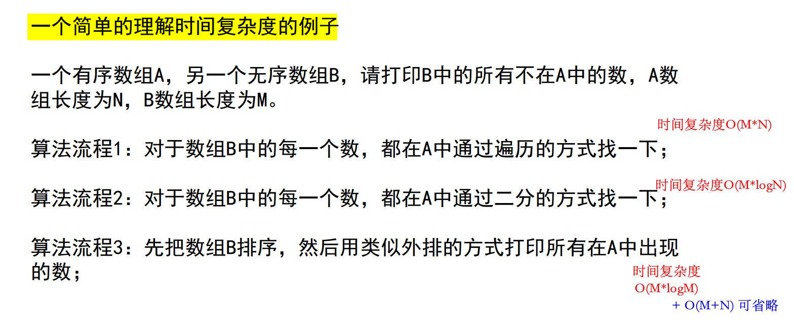
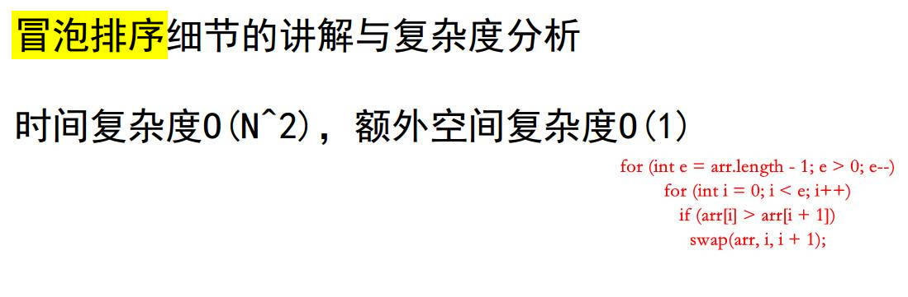
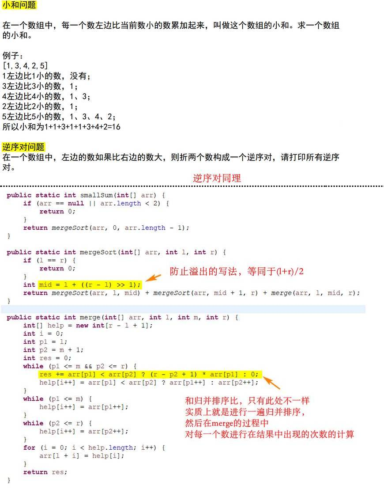

# 1
### 时间复杂度

---
### 冒泡排序

---
### 选择排序

---
### 插入排序

---
### 递归复杂度

---
### 归并排序

---
### 小和问题和逆序对问题

---

# 2
### 荷兰国旗问题（快排的基础）

---
### 快排
- 时间复杂度O(NlogN)， 额外空间复杂度O(logN)（**需记录哨兵的下标位置**）
- 经典快排
	- 只有小于等于区间和大于区间
	- 有小于区间，等于区间，和大于区间
	- 复杂度受数据状况影响，当原数组有序时，复杂度退化至O(N^2)
- 随机快排
	- 其它和经典快排一样，只是随机选择一个当做哨兵
	
---
### 堆排序
- 堆结构的heapInsert与heapify
	- 
- 如果只是建立堆的过程， 时间复杂度为O(N)
- 优先级队列结构，就是堆结构